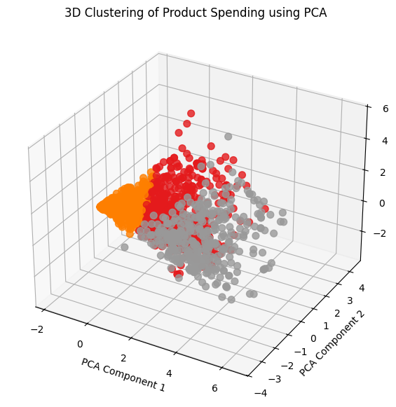

# productsalesanalysis
# 🛍️ Customer Segmentation using KMeans and PCA

## 📌 Project Overview

This project applies **KMeans Clustering** and **Principal Component Analysis (PCA)** to segment customers based on their **product spending behavior**. The goal is to help the marketing team gain actionable insights for **targeted campaigns** and **product improvement strategies**.

---

## 🧾 Problem Statement

**Title:**  
**Customer Segmentation for Targeted Marketing Based on Product Spending Behavior**

### 🧠 Context
A retail company aims to improve the effectiveness of its marketing strategies. With historical customer data containing spending information across six product categories, the company wants to discover hidden customer segments and use those insights for personalized outreach.

### ❌ Current Challenge
- Marketing campaigns are generic and not tailored to customer interests.
- Low customer engagement.
- Underperformance in specific product categories.

---

## 🎯 Project Goal

Leverage unsupervised machine learning (KMeans Clustering) and dimensionality reduction (PCA) to:

- Identify distinct customer segments.
- Understand the behavior of each segment based on spending.
- Empower the marketing team with targeted strategies:
  - Improve engagement among low-spending customers.
  - Drive upselling opportunities among high-value customers.
  - Boost revenue in underperforming product categories.

---

## 🧪 Methods Used

- 🧹 Data Cleaning and Preprocessing
- 📈 Feature Selection (6 product features)
- ⚙️ KMeans Clustering (3 clusters)
- 📉 Principal Component Analysis (PCA) – 3D visualization
- 📊 Revenue Analysis per Product
- 📎 Insight Extraction and Interpretation

---

## 📊 Results

The following 3D scatter plot shows the **customer clusters** after applying KMeans and visualizing them using PCA:



### 💡 Cluster Interpretation
- **Cluster 0** (Gray): Low spenders – price-sensitive or low-engagement customers.
- **Cluster 1** (Orange): Loyal buyers – consistent spending in focused categories.
- **Cluster 2** (Red): High/mixed spenders – potential premium or varied-interest customers.

---

## 📁 Files

- `marketing_campaign.csv`: Raw dataset
- `cluster_analysis.ipynb`: Main notebook containing all preprocessing, clustering, PCA, and visualizations
- `README.md`: Project summary and insights

---

## 🚀 How to Run

1. Clone this repo:
   ```bash
   git clone https://github.com/lingaa005/productsalesanalysis.git
   cd productsalesanalysis
